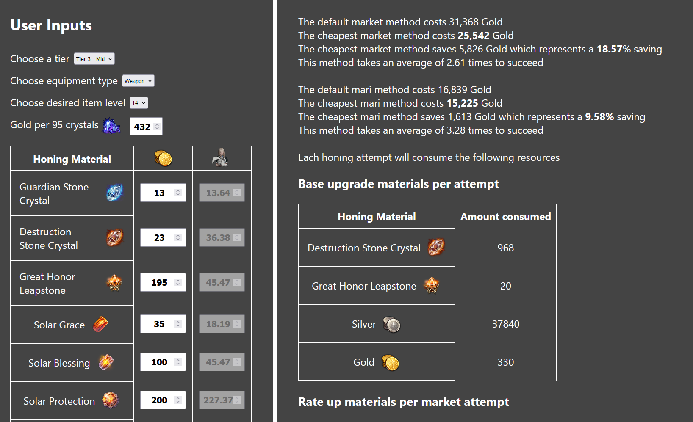

# Lost Ark Honing Calculator
Link: [Honing Calculator](https://honing-calculator.surge.sh)
## Overview
- Lost Ark is a rpg game where one of the core mechanics is upgrading gear through a process called "honing" 
- Each honing level has a base chance of succeeding and consumes a fixed amount of resources. Additional rate-up materials up to a certain amount can be added to increase this base chance
- The resources can be obtained through an in-game auction market by buying from other players using a currency called "gold". Alternatively, they can also be acquired using gems from the in-game store which is also purchased with gold
- This web app attempts to optimise the cheapest statistical method to successfully upgrade gear based on current market pricings which the player inputs. It provides the user with which source to purchase resources from along with how many rate-up materials to add if applicable.

<p>
    &nbsp&nbsp&nbsp&nbsp
</p>

## Technologies used
* **Bundler**: Webpack
* **Framework**: React/TypeScript
* **Linting and formatting**: ESLint, Prettier
* **Styling**: Styled Components
## Setup

```sh
npm install
npm start
```

This will open a development server at [http://localhost:3000](http://localhost:3000).

